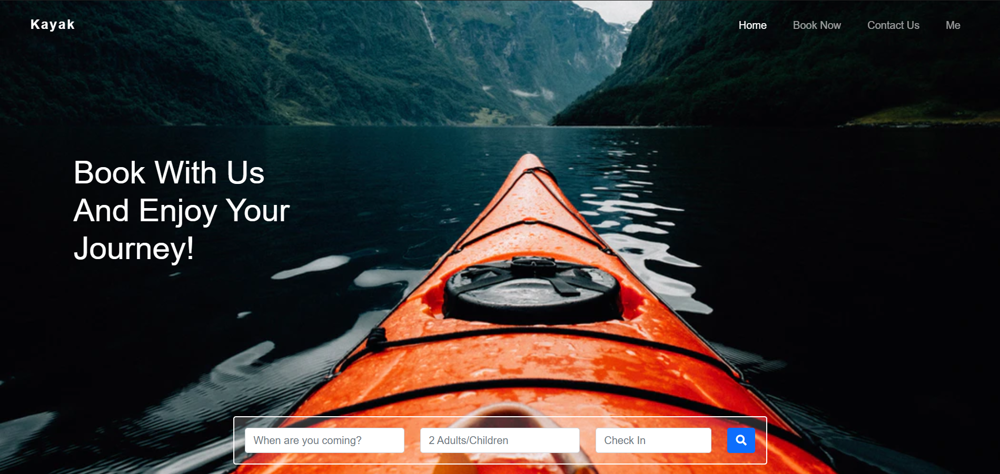
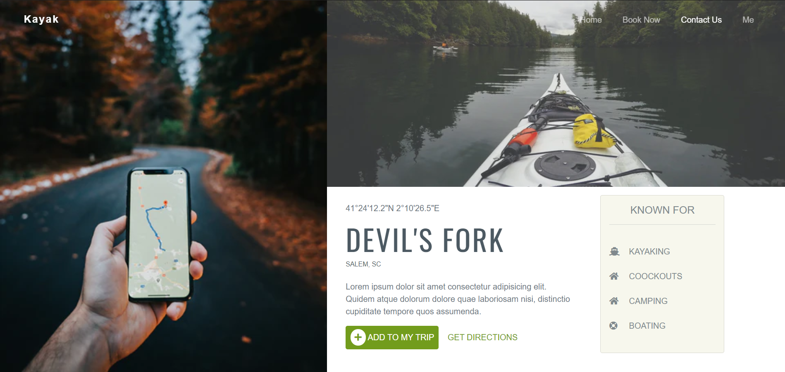
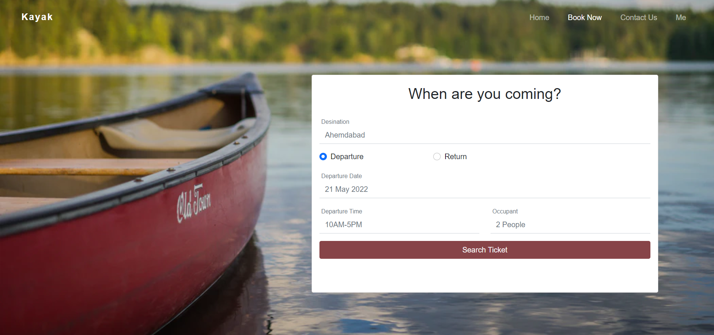

# Kayak Angular Template
## ScreenShots

## Home
Kayak Book from home UI <a href="https://dribbble.com/shots/14858234-Travel-Web-UI-Exploration">Inpiration</a>

## Location 
Kayak Book from home UI <a href="https://dribbble.com/shots/11063330-Location-Preview">Inpiration</a>

## Book
Booking Tab For Kayak

This project was generated with [Angular CLI](https://github.com/angular/angular-cli) version 11.2.10.

## Development server

Run `ng serve` for a dev server. Navigate to `http://localhost:4200/`. The app will automatically reload if you change any of the source files.

## Code scaffolding

Run `ng generate component component-name` to generate a new component. You can also use `ng generate directive|pipe|service|class|guard|interface|enum|module`.

## Build

Run `ng build` to build the project. The build artifacts will be stored in the `dist/` directory. Use the `--prod` flag for a production build.

## Further help

To get more help on the Angular CLI use `ng help` or go check out the [Angular CLI Overview and Command Reference](https://angular.io/cli) page.
